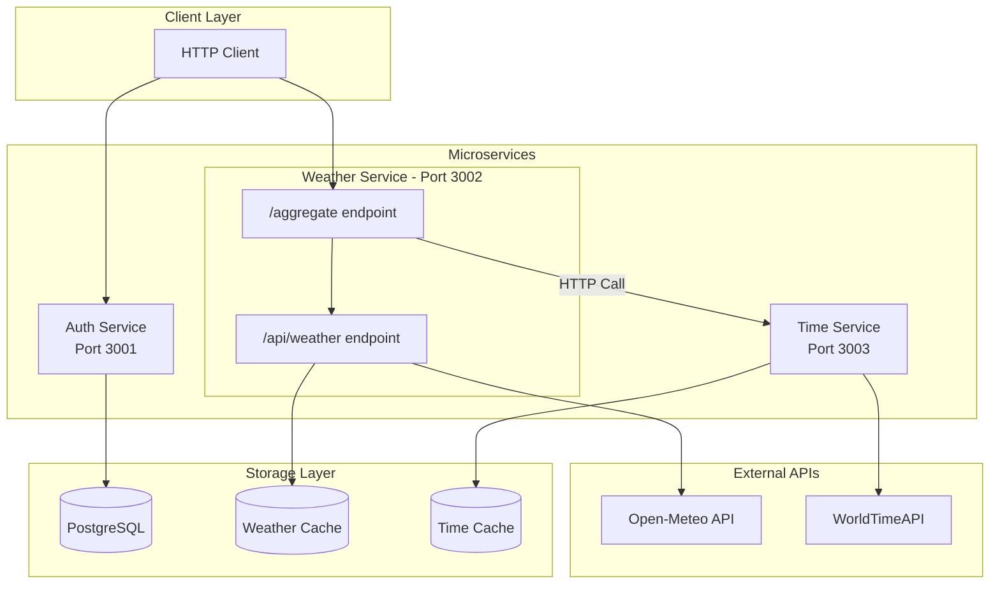
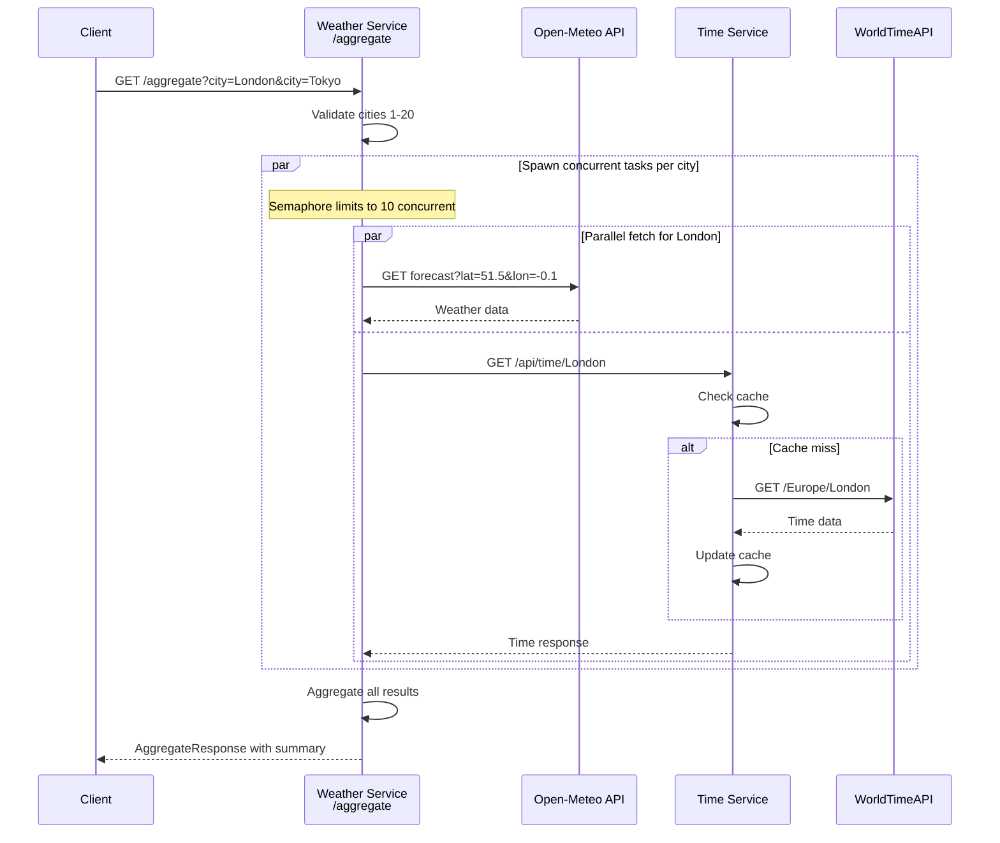
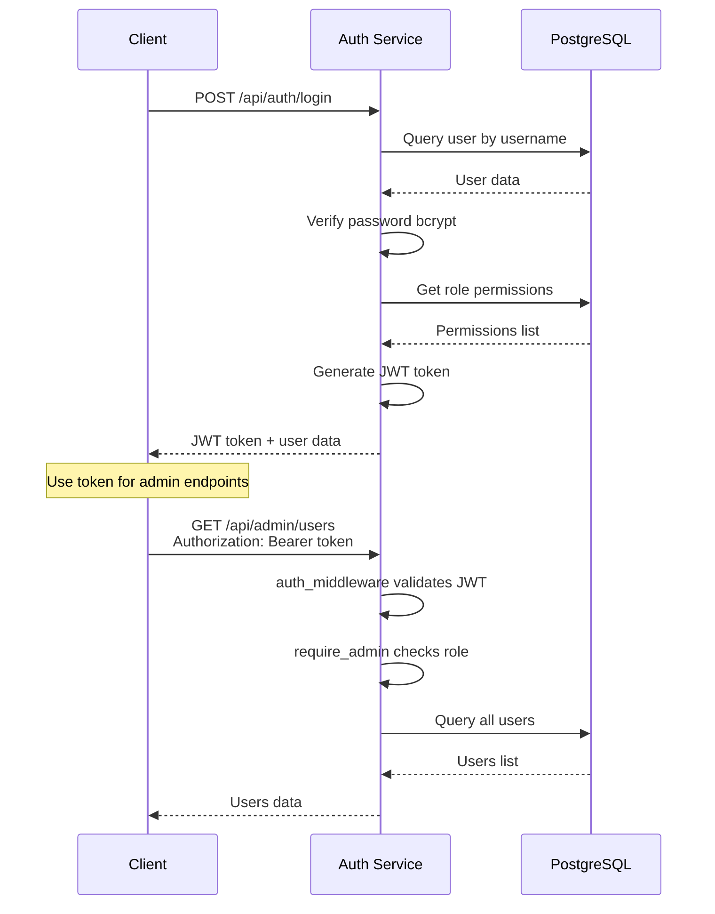
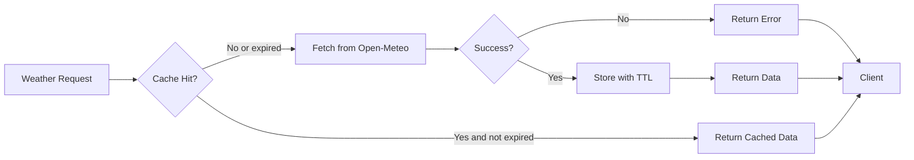
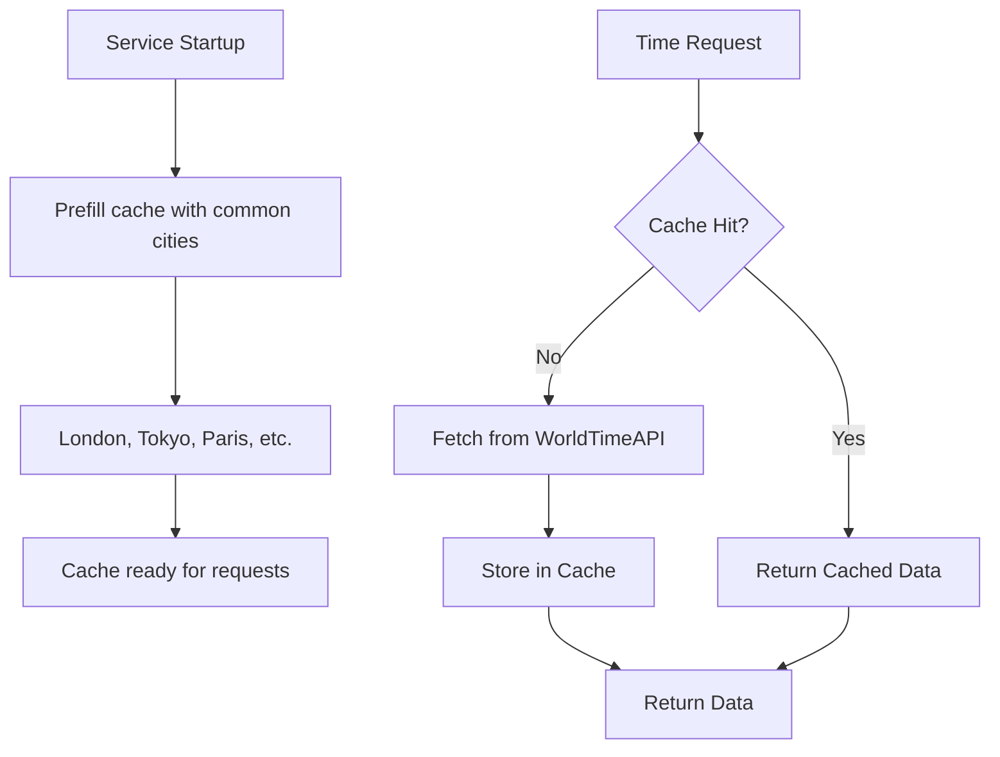
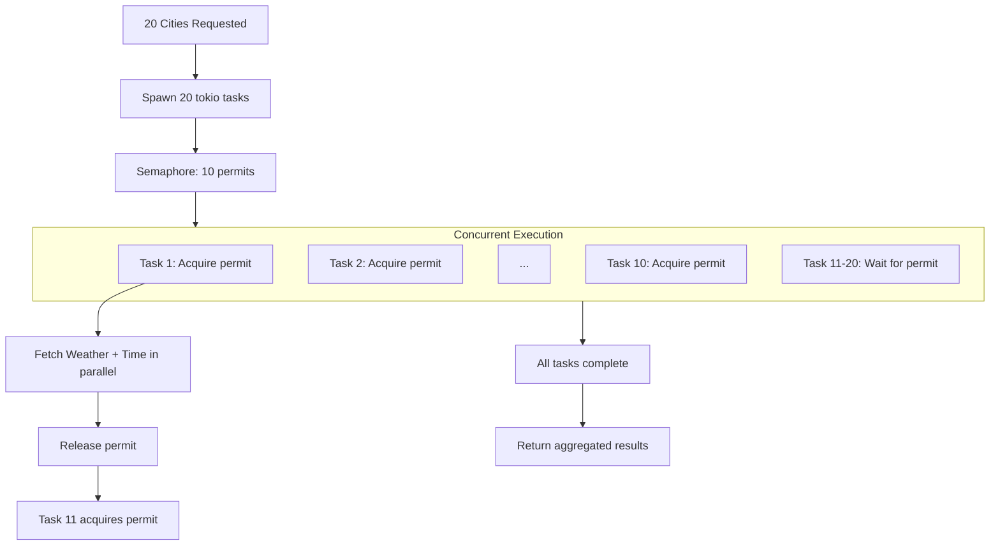
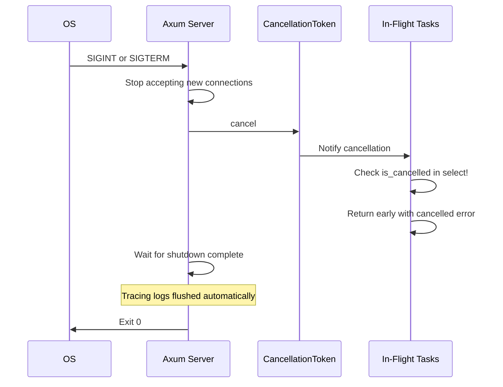
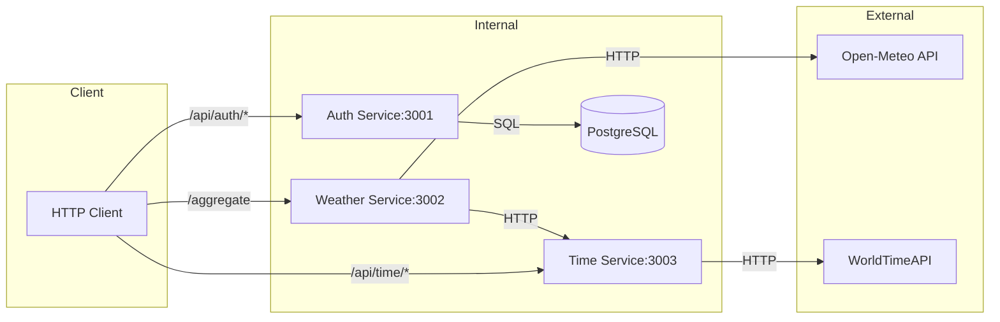

# System Architecture Flowcharts

## Service Architecture



## Service Communication

The services communicate as follows:

1. **Client to Weather Service**: HTTP requests to `/aggregate` or `/api/weather/{city}`
2. **Client to Auth Service**: HTTP requests for login/register and admin operations
3. **Client to Time Service**: HTTP requests to `/api/time/{city}`
4. **Weather Service to Time Service**: HTTP call from Aggregator to fetch time data
5. **Weather Service to Open-Meteo**: HTTP call to external weather API
6. **Time Service to WorldTimeAPI**: HTTP call to external time API

## Aggregate Request Flow



## Authentication Flow



## Caching Strategy

### Weather Cache (TTL-based)


### Time Cache (Startup prefill)


## Concurrency Control



## Graceful Shutdown



## Error Handling Flow

```mermaid
flowchart TD
    A[API Call] --> B{Timeout 2s?}
    B -->|Yes| C[TimeoutError]
    B -->|No| D{HTTP Status?}
    D -->|4xx/5xx| E[HttpError]
    D -->|Success| F{Parse JSON?}
    F -->|Fail| G[ParseError]
    F -->|Success| H[Return Data]
    
    D -->|Connection failed| I[NetworkError]
    
    C --> J{Retry count < 2?}
    E --> J
    G --> J
    I --> J
    
    J -->|Yes| K[Exponential backoff]
    K --> L[100ms, 200ms delay]
    L --> A
    
    J -->|No| M[Return error to caller]
    
    Note over M: Per-city errors tracked in response
```

## Data Flow Summary


